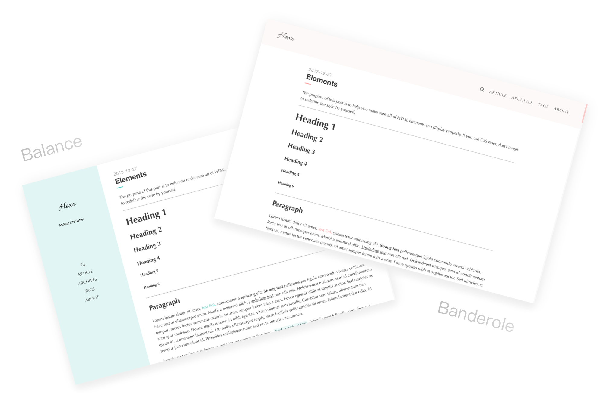

# hexo-theme-Nlvi

> A simple theme named Nlvi for hexo.

在线预览 · [Banderole][1] · [Balance][2]

[主题文档|Theme Wiki][3]




(前排提醒老粉：你们熟悉的Nlvi现已归入 1.x 分支与 2.x 分支)

## 特点 Special

- 使用了动画库 [Syuanpi.css][4]
- 使用了 Lightbox
- 自定义样式
- 文章打赏（二维码）
- 版权说明
- 主题：常规颜色、桜、初音绿、雪初音蓝。自定义颜色（建议明度不要太高）

## 语言 Language

- 简体中文
- 正體中文（你可以告知我哪裡出問題，多謝。）
- English (Please tell me all errors if you mind. Thank you very much.)
- 日本語 「テーマはすべてのエラーを教えてください、ありがとうございました。」

## 下载 Download

你有三种方式下载到Nlvi

1. `git clone https://github.com/ColMugX/hexo-theme-Nlvi.git themes/Nlvi`

2.  `Download ZIP`

3.  `Open in Desktop`

## 安装 Install

1. 在 Hexo 所在目录中执行以下命令。
  
  ```bash
  npm i hexo-renderer-swig --save
  ```
  
2. 放到你的 Hexo 项目的`themes`文件夹里面，修改你的 Hexo 项目的 `_config.yml` 里面的`theme`如下。
  
  ```yaml
  # Extensions
  ## Plugins: https://hexo.io/plugins/
  ## Themes: https://hexo.io/themes/
  theme: Nlvi
  ```

## 配置 Setting

须将`_source`文件夹里面的`about`目录拷贝到项目中的`source`目录中，**这点很重要！**

### 支持 Support

{Issue, Email, Zhihu?}

[1]: https://colmugx.github.io/banderole/
[2]: https://colmugx.github.io/balance/
[3]: https://github.com/ColMugX/hexo-theme-Nlvi/wiki
[4]: https://github.com/colmugx/syuanpi.css
