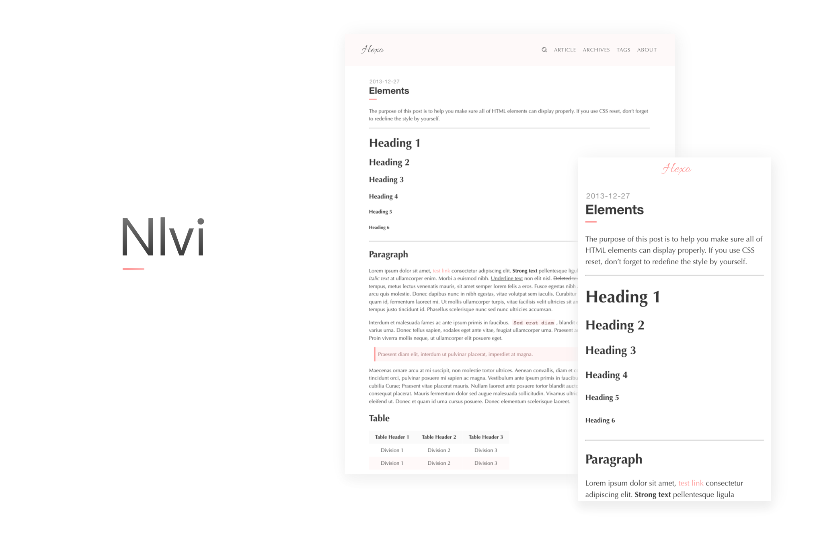

# hexo-theme-Nlvi

> A simple theme named Nlvi for hexo.

[在线预览 · Banderole](https://colmugx.github.io/banderole/)
[ · Balance](https://colmugx.github.io/balance/)

[主题文档|Theme Wiki](https://github.com/ColMugX/hexo-theme-Nlvi/wiki)



(前排提醒老粉：你们熟悉的Nlvi现已归入 1.x 分支与 2.x 分支)

## 特点 Special

- 使用了动画库 [syuanpi.css](https://github.com/colmugx/syuanpi.css)
- 使用了lightbox
- 自定义样式
- 文章打赏（二维码）
- 版权说明
- 主题：常规颜色、桜、初音绿、雪初音蓝

## 语言 Language

- 简体中文
- 正體中文（你可以告知我哪裡出問題，多謝。）
- English ( Please tell me all errors if you mind. Thank you very much. )
- 日本語 「テーマはすべてのエラーを教えてください、ありがとうございました。」

## 下载 Download

你有三种方式下载到Nlvi

1. `git clone https://github.com/ColMugX/hexo-theme-Nlvi.git themes/Nlvi`

2.  `Download ZIP`

3.  `Open in Desktop`

## 安装 Install

放到你的hexo的theme里面，修改你hexo的_config.yml里面的theme

```yaml
# Extensions
## Plugins: https://hexo.io/plugins/
## Themes: https://hexo.io/themes/
theme: Nlvi
```

## 配置 Setting

要把_source文件夹里面的about拷贝到项目中的source中，**这点很重要！**

## 截图/风格展示 Screenshot/Schemes

### 支持 Support

{Issue, Email, Zhihu?}

